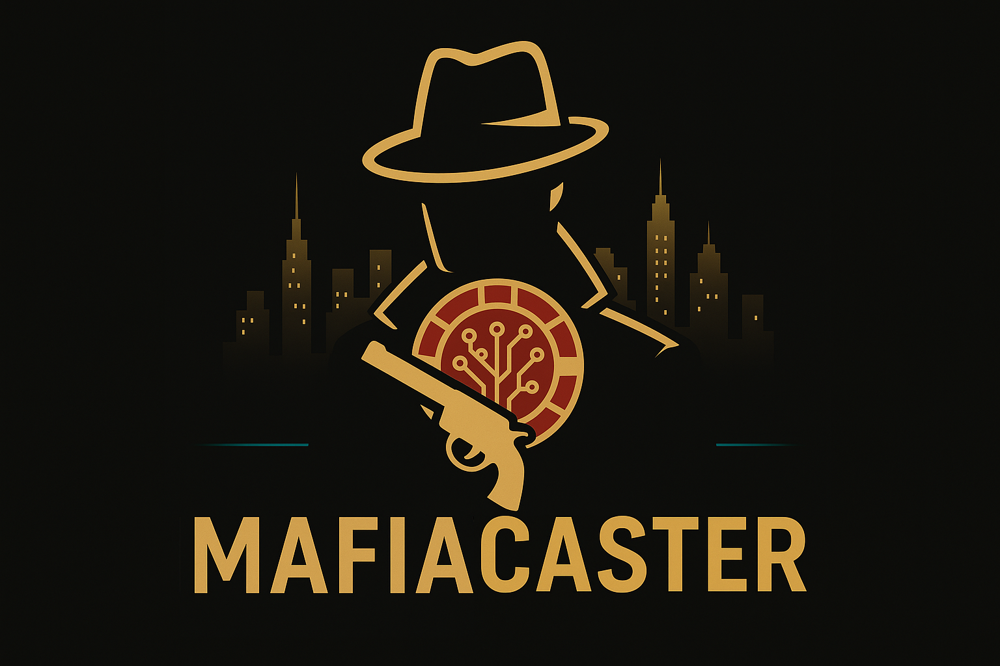

# MafiaCaster

<p align="center">
  
</p>

# Contracts

`MafiaCaster` is a game that allows users to participate in missions using an energy system, ERC20 and ERC1155 tokens. Users can claim or purchase energy, complete missions that consume resources and grant rewards, and invest funds that are deposited into an Aave-like pool to generate yield. After a fixed period, the invested funds can be withdrawn by the users. The rewards earned from the Aave protocol are used to fund the platform itself. The contract provides administrative functions for managing missions and claiming

## Deploys

- MafiaCaster: [0xc9ae8da750ac66c686a748cbbdecd851abac9362](https://sepolia.basescan.org/address/0xc9ae8da750ac66c686a748cbbdecd851abac9362#code)
- Money: [0xdAB47FF5dd2177A0A6625aBa974316C5D42c8AD1](https://sepolia.basescan.org/address/0xdAB47FF5dd2177A0A6625aBa974316C5D42c8AD1#code)
- Items: [0xC380a99D7a4764E1b7b7f389488987853Ce221cc](https://sepolia.basescan.org/address/0xC380a99D7a4764E1b7b7f389488987853Ce221cc#code)

### Mission TXs

- Mission 1, loss: [0xad891b97b7edb25a59c8636231454087f94d2bdf4ed15fe02a498109abe8e6be](https://sepolia.basescan.org/tx/0xad891b97b7edb25a59c8636231454087f94d2bdf4ed15fe02a498109abe8e6be#eventlog)

- Mission 1, win[money]: [0xa8ccdb556d6f630a1569b4a3dcf992a45a250938e1a616514dc204481f75a3d4](https://sepolia.basescan.org/tx/0xa8ccdb556d6f630a1569b4a3dcf992a45a250938e1a616514dc204481f75a3d4)

- Mission 1, win[money]: [0xbe4c73133a5160b9e3ca3e3a5c1ace10b54aabfc61c17a2fa0abb81752e33260](https://sepolia.basescan.org/tx/0xbe4c73133a5160b9e3ca3e3a5c1ace10b54aabfc61c17a2fa0abb81752e33260)

- Mission 2, loss[money]: [0x3b9c9525eab2a2fac8b9f611a805a5bc6aed5c21033b98692d9`617f9bacf6367](https://sepolia.basescan.org/tx/0x3b9c9525eab2a2fac8b9f611a805a5bc6aed5c21033b98692d9`617f9bacf6367)

- Mission 2, loss[money]: [0xe3dc8fd96855162fda2bba9fc33ee0fb51630b11e722d9c7097085a729dc018b](https://sepolia.basescan.org/tx/0xe3dc8fd96855162fda2bba9fc33ee0fb51630b11e722d9c7097085a729dc018b)

- Mission 2, win[money, item 1 amount 1]: [0x2b977e15bd89b07b3c71d368c6058fd0ca48c71381a92cad7d26180cfec933e8](https://sepolia.basescan.org/tx/0x2b977e15bd89b07b3c71d368c6058fd0ca48c71381a92cad7d26180cfec933e8)

- Mission 3, loss[money, item 1 amount 1]: [0x1073c0f1f7b8a0a1d0823faba8be7f20005e14245b0fa805d849753d72f7e076](https://sepolia.basescan.org/tx/0x1073c0f1f7b8a0a1d0823faba8be7f20005e14245b0fa805d849753d72f7e076)

- Mission 3, win[money, item 2 amount 3, item 1 amount 5]: [0x74c0e27a33d88d7a2035f3e84619f54dae455e233765fd56092790e899fc2b76](https://sepolia.basescan.org/tx/0x74c0e27a33d88d7a2035f3e84619f54dae455e233765fd56092790e899fc2b76)

## Features

- **Missions:** Define missions with requirements (ERC20/1155) and rewards (ERC20/1155).
- **Energy System:** Users spend and claim energy to perform actions.
- **Investments:** Users can buy energy, which deposits funds into a pool for a fixed period.
- **Aave Integration:** Funds are supplied/withdrawn from a lending pool.
- **Rewards:** Protocol rewards can be claimed by the owner and are used to fund the protocol.

## Constructor

```solidity
constructor(
    IPool _pool,
    IRewardsController _rewardsController
)
```
- `_pool`: Lending pool contract (e.g., Aave).
- `_rewardsController`: Rewards controller for claiming protocol rewards.

## Main Functions

### Missions

- `addMission(Mission calldata mission)`: Add a new mission (owner only).
- `toggleMissionEnable(uint256 id)`: Enable/disable a mission (owner only).
- `doMission(uint256 id)`: Attempt a mission, spending energy and burning required tokens.

### Energy

- `claimEnergy()`: Claim energy based on elapsed time.
- `buyEnergy(uint256 amount)`: Buy energy with ether, which is deposited into the pool.

### Investments

- `returnFunds(uint256 investId)`: Withdraw invested funds after the lock period.

### Rewards

- `claimProtocolRewards()`: Owner claims all protocol rewards from the rewards controller. The rewards received from Aave are used to fund the protocol.

## Data Structures

- `Mission`: Requirements and rewards for a mission.
- `Invest`: User investment details.
- `User`: Tracks user energy, last claim, and investments.

## Utility Functions

- `getMissionReqIds1155`, `getMissionReqAmounts1155`, `getMissionRewIds1155`, `getMissionRewAmounts1155`: View mission requirements and rewards.
- `getUsersInvest(address user, uint256 id)`: View a user's investment.

## Security Notes

- Only the contract owner can add/toggle missions and claim protocol rewards.
- Randomness for mission outcomes uses `block.prevrandao`, which is not secure for high-value randomness.

## Example Usage

1. **Owner** adds a mission.
2. **User** claims energy.
3. **User** does a mission, spending energy and possibly receiving rewards.
4. **User** buys more energy (funds are invested).
5. **User** withdraws funds after investment period.
